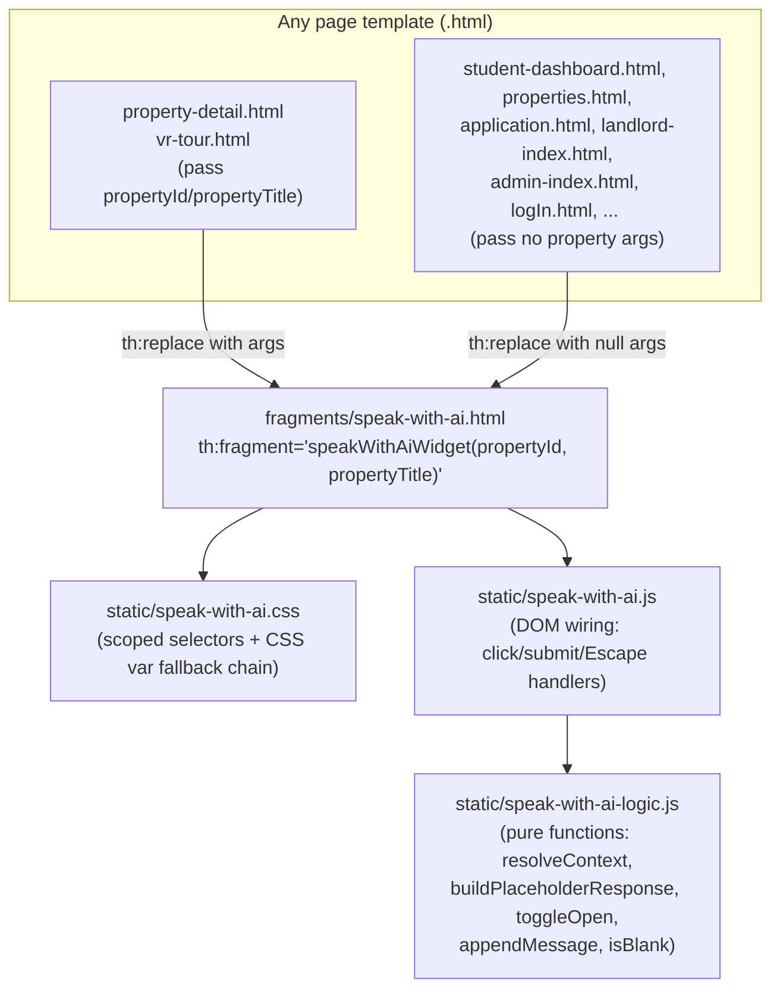

# Design Document

## Overview

"Speak with AI" adds a persistent floating chat widget to every page of the ULEE Thymeleaf application. The widget is built as a **single reusable Thymeleaf fragment** so its markup, styling, and behavior live in one place and can be dropped onto any template — regardless of which of the app's several divergent design systems (student Tailwind/hero-yellow, teal `Sora`/`Playfair Display` dashboard pages, unstyled/legacy pages) that template currently uses.

This spec covers UI scaffolding only: opening/closing the panel, sending messages, and receiving a **placeholder** response. No real AI backend exists yet. The chosen approach is a **client-side, JavaScript-only placeholder response engine** — no new controller endpoint is introduced — because:

- The response is a fixed transformation of the user's text and the current page's property context, which needs no server state or persistence.
- Avoiding a network round trip makes the "respond within 1 second" requirement (4.1) trivial to satisfy deterministically, and keeps the response engine a pure, easily property-tested function.
- It keeps the implementation entirely front-end, which matches the spec's explicit boundary that a real AI integration is a separate, future spec (likely introducing a real endpoint at that point).

The widget must also be aware of **Property_Detail_Page** context on two existing routes (`/property/{id}` → `property-detail.html`, `/property/{id}/vr-tour` → `vr-tour.html`), both of which already load a `property` model attribute in their controllers (`PropertyController.viewPropertyDetail`, `PanoramaController.viewVRTour`). The fragment receives `propertyId`/`propertyTitle` as **Thymeleaf fragment parameters** from whichever controller renders the page, and falls back to General_Context when they're absent or blank.

## Architecture

### Component layout



**Why a pure-logic module is split out:** `speak-with-ai-logic.js` contains everything that has no DOM dependency — context resolution, message-list transformations, the placeholder response builder, and the open/close toggle reducer. `speak-with-ai.js` only wires DOM events to those pure functions and re-renders. This split is what makes the Correctness Properties section testable without a browser (Node + a property-based testing library), while a thin layer of DOM-dependent example tests covers wiring.

### Why a Thymeleaf fragment with parameters (not a controller advice / interceptor)

Thymeleaf supports parameterized fragments (`th:fragment="name(p1, p2)"`), which is the natural fit here: the two Property_Detail_Page controllers already have the property loaded in their `Model` when the view renders, so passing `${property.propertyID}` / `${property.title}` as fragment arguments needs no new cross-cutting infrastructure (no `HandlerInterceptor`, no `ControllerAdvice`). Pages with no property simply pass `null, null`, which the fragment/JS treats as General_Context. This keeps the change local to each template's include line and avoids adding global request attributes for a UI-only feature.

## Components and Interfaces

### 1. `templates/fragments/speak-with-ai.html`

```html
<!DOCTYPE html>
<html xmlns:th="http://www.thymeleaf.org">
<body>
<!--
  Speak with AI — reusable floating chat widget.

  Usage (Property_Detail_Page — Property_Context):
    <div th:replace="~{fragments/speak-with-ai :: speakWithAiWidget(${property.propertyID}, ${property.title})}"></div>

  Usage (any other page — General_Context):
    <div th:replace="~{fragments/speak-with-ai :: speakWithAiWidget(null, null)}"></div>

  Requires (link once per page, alongside this include):
    <link rel="stylesheet" href="/speak-with-ai.css">
    <script src="/speak-with-ai-logic.js" defer></script>
    <script src="/speak-with-ai.js" defer></script>
-->
<div th:fragment="speakWithAiWidget(propertyId, propertyTitle)"
     class="swai-root"
     id="swai-root"
     th:attr="data-property-id=${propertyId},data-property-title=${propertyTitle}">

  <button type="button" id="swai-icon" class="swai-icon" aria-label="Open chat assistant" aria-expanded="false">
    <svg viewBox="0 0 24 24" width="24" height="24" fill="none" stroke="currentColor" stroke-width="2">
      <path d="M21 11.5a8.38 8.38 0 0 1-.9 3.8 8.5 8.5 0 0 1-7.6 4.7 8.38 8.38 0 0 1-3.8-.9L3 21l1.9-5.7a8.38 8.38 0 0 1-.9-3.8 8.5 8.5 0 0 1 4.7-7.6 8.38 8.38 0 0 1 3.8-.9h.5a8.48 8.48 0 0 1 8 8v.5z"/>
    </svg>
  </button>

  <section id="swai-panel" class="swai-panel" hidden aria-hidden="true" role="dialog" aria-label="Chat assistant">
    <header class="swai-panel-header">
      <span class="swai-title" id="swai-title">Assistant</span>
      <button type="button" id="swai-close" class="swai-close" aria-label="Close chat">&times;</button>
    </header>

    <div id="swai-history" class="swai-history" aria-live="polite"></div>

    <form id="swai-form" class="swai-form">
      <input id="swai-input" class="swai-input" type="text" autocomplete="off"
             placeholder="Type a message…" aria-label="Message input" />
      <button type="submit" class="swai-send" aria-label="Send message">Send</button>
    </form>
  </section>
</div>
</body>
</html>
```

`data-property-id` / `data-property-title` are the only channel data crosses from Thymeleaf into JS — no inline `th:inline="javascript"` block is needed since both values are simple scalars.

### 2. `static/speak-with-ai-logic.js` (pure, DOM-free — the testable core)

```js
// Exposed as window.SwaiLogic in the browser, and via module.exports for Node tests.
const SwaiLogic = {
  /** For all inputs, returns true only for strings that are empty or all-whitespace. */
  isBlank(text) {
    return typeof text !== 'string' || text.trim().length === 0;
  },

  /**
   * Resolves whether the widget operates in Property_Context or General_Context.
   * Property_Context requires BOTH a truthy propertyId and a non-blank propertyTitle.
   */
  resolveContext({ isPropertyPage, propertyId, propertyTitle }) {
    const hasUsableTitle = !this.isBlank(propertyTitle);
    if (isPropertyPage && propertyId != null && hasUsableTitle) {
      return { mode: 'property', propertyId, propertyTitle: propertyTitle.trim() };
    }
    return { mode: 'general' };
  },

  /** Pure placeholder response builder — no I/O, no timers. */
  buildPlaceholderResponse(userText, context) {
    if (context.mode === 'property') {
      return `Thanks for asking about "${context.propertyTitle}"! I'm a placeholder assistant for now, ` +
             `but soon I'll be able to answer real questions about this listing.`;
    }
    return `Thanks for your message! I'm a placeholder assistant for now, but real AI answers are coming soon.`;
  },

  /** For all message arrays and a new message, returns a NEW array with it appended (no mutation). */
  appendMessage(messages, message) {
    return [...messages, message];
  },

  /** For all boolean panel states, returns the inverted state. */
  toggleOpen(isOpen) {
    return !isOpen;
  }
};

if (typeof module !== 'undefined' && module.exports) module.exports = SwaiLogic;
if (typeof window !== 'undefined') window.SwaiLogic = SwaiLogic;
```

### 3. `static/speak-with-ai.js` (DOM wiring — thin, example-tested)

Responsibilities, all delegating to `SwaiLogic`:
- On load: reads `data-property-id`/`data-property-title` off `#swai-root`, calls `resolveContext({ isPropertyPage: <both attrs present>, propertyId, propertyTitle })` once, and sets `#swai-title` text to the property title when in Property_Context (Requirement 5.2), leaving the generic "Assistant" label otherwise.
- Click on `#swai-icon`: `isOpen = SwaiLogic.toggleOpen(isOpen)`; toggles `hidden`/`aria-hidden`/`aria-expanded`; on the transition into open **for the first time this page view**, appends a canned greeting message (context-aware: includes the property title if in Property_Context) before anything else is in history (Requirement 3.5).
- Click on `#swai-close`, and `keydown` (Escape) while the panel is open: force `isOpen = false` unconditionally, regardless of current message-history/input contents (Requirements 2.4, 2.5).
- Submit on `#swai-form`: reads `#swai-input.value`; if `SwaiLogic.isBlank(value)`, prevents default and does nothing further (Requirement 3.4); otherwise appends a `{sender:'user', text, ts}` message via `SwaiLogic.appendMessage`, re-renders `#swai-history`, clears and refocuses `#swai-input`, then schedules the assistant reply with `setTimeout(..., ~1000ms cap)` that calls `SwaiLogic.buildPlaceholderResponse(text, context)` and appends a `{sender:'assistant', ...}` message (Requirements 3.3, 4.1, 4.2 — the call is a local `setTimeout`, never `fetch`/`XMLHttpRequest`).
- Renders each message into `#swai-history` with `class="swai-msg swai-msg-user"` or `class="swai-msg swai-msg-assistant"` so the two are visually distinguishable via CSS (Requirement 4.3).
- All state (`isOpen`, `hasGreeted`, `messages[]`, `context`) is held in **plain JS closures/module-level variables scoped to the current page load** — nothing is written to `localStorage`, `sessionStorage`, or a cookie, matching the requirements doc's explicit assumption that history does not survive a full navigation.

### 4. `static/speak-with-ai.css`

Scoped entirely under `.swai-root` / `#swai-icon` / `#swai-panel` selectors so it cannot leak into host-page styles. Cross-theme consistency (Requirement 6) is achieved with a **CSS variable fallback chain** rather than per-page overrides, so the widget adapts automatically wherever a page already exposes hero design tokens, and otherwise falls back to the hero-yellow direction called out as the app's target style:

```css
.swai-root {
  --swai-accent:   var(--hero-yellow, var(--primary, #ffe170));
  --swai-on-accent: var(--hero-on-yellow, #221b00);
  --swai-radius:   var(--hero-radius-pill, 999px);
  --swai-panel-radius: var(--hero-radius-glass, 16px);
  --swai-font:     var(--hero-font-body, var(--font-body, 'Hanken Grotesk', sans-serif));
  --swai-font-display: var(--hero-font-display, var(--font-display, 'Plus Jakarta Sans', sans-serif));
  position: fixed;
  bottom: 20px;
  right: 20px;
  z-index: 1000;
  font-family: var(--swai-font);
}

.swai-icon {
  width: 56px; height: 56px;
  border-radius: var(--swai-radius);
  background: var(--swai-accent);
  color: var(--swai-on-accent);
  border: none;
  box-shadow: 0 6px 20px rgba(0,0,0,0.18);
  cursor: pointer;
}

.swai-panel {
  position: absolute;
  bottom: 72px; right: 0;
  width: 320px; max-height: 420px;
  border-radius: var(--swai-panel-radius);
  background: #ffffff;
  box-shadow: 0 10px 40px rgba(0,0,0,0.22);
  display: flex; flex-direction: column;
  transform-origin: bottom right;
  animation: swaiExpand 0.25s cubic-bezier(0.4,0,0.2,1);
}
.swai-panel[hidden] { display: none; }

@keyframes swaiExpand {
  from { opacity: 0; transform: scale(0.85) translateY(12px); }
  to   { opacity: 1; transform: scale(1) translateY(0); }
}

.swai-msg { padding: 8px 12px; border-radius: 12px; margin: 4px 8px; max-width: 80%; font-size: 13px; }
.swai-msg-user      { background: var(--swai-accent); color: var(--swai-on-accent); margin-left: auto; }
.swai-msg-assistant  { background: #f1f1f1; color: #1a1a1a; margin-right: auto; }
```

Because `--hero-yellow`, `--hero-radius-pill`, `--hero-font-body`, and `--hero-font-display` are already the real custom-property names defined in `static/hero-theme.css` (used across the student/hero-styled pages), any page that links `hero-theme.css` gets exact token matching "for free." Pages that only define ad-hoc variables like `--primary`/`--font-body` (the teal dashboard pages, none of which currently expose those as CSS vars) fall through to the hard-coded hero-yellow defaults — which is the explicitly requested default direction — without needing per-page CSS edits. No existing page needs to change its own CSS for this to work.

### Templates requiring the fragment include

**Property_Context (must pass `propertyId`/`propertyTitle`):**
| Template | Route | Model attribute already available |
|---|---|---|
| `templates/property-detail.html` | `GET /property/{id}` | `property` (`PropertyController.viewPropertyDetail`) |
| `templates/vr-tour.html` | `GET /property/{id}/vr-tour` | `property` (`PanoramaController.viewVRTour`) |

**General_Context (representative sample — pass `null, null`; the task list will enumerate every remaining template in the app for full "every page" coverage per Requirement 1's intent):**
| Template | Design system today |
|---|---|
| `templates/student/student-dashboard.html` | Tailwind + hero-yellow (`--tertiary-fixed: #ffe170`) |
| `templates/properties.html` | Plain CSS, hero-yellow tokens already declared inline |
| `templates/application.html` | Plain CSS (`application.css`), teal/Sora dashboard system |
| `templates/landlord/landlord-index.html` | Plain CSS, teal/Academic-Vitality dashboard system |
| `templates/admin/admin-index.html` | Plain CSS, teal/Sora dashboard system |
| `templates/logIn.html` | Plain CSS, currently `DM Sans`/flat-dark theme |

Each of these gets a single new include line right before `</body>`, plus the two `<link>`/`<script>` tags noted in the fragment's usage comment.

## Data Models

Plain JS objects (no persistence layer — nothing is saved to a database or client storage in this spec):

```js
/**
 * @typedef {Object} ChatMessage
 * @property {string} id        - unique id (e.g. crypto.randomUUID() or incrementing counter)
 * @property {'user'|'assistant'} sender
 * @property {string} text
 * @property {number} ts         - Date.now() at creation
 */

/**
 * @typedef {Object} WidgetContext
 * @property {'property'|'general'} mode
 * @property {number} [propertyId]
 * @property {string} [propertyTitle]
 */

/**
 * @typedef {Object} WidgetState   - held in JS closure only, for the current page view
 * @property {boolean} isOpen
 * @property {boolean} hasGreeted
 * @property {WidgetContext} context
 * @property {ChatMessage[]} messages
 */
```

## Correctness Properties

*A property is a characteristic or behavior that should hold true across all valid executions of a system-essentially, a formal statement about what the system should do. Properties serve as the bridge between human-readable specifications and machine-verifiable correctness guarantees.*

**Property reflection note:** the prework identified several properties that describe the same underlying state machine or function from different angles (e.g. "icon opens the panel" and "icon closes the panel" are both just "icon inverts state"; "history preserves order" and "history retains everything" both describe the same append-only list). These have been consolidated below into ten properties, each targeting a single pure function or invariant in `speak-with-ai-logic.js`.

### Property 1: Icon toggles panel state unconditionally

*For any* current boolean open/closed state of the Chat_Panel, activating the Chat_Icon SHALL invert that state (closed becomes open, open becomes closed).

**Validates: Requirements 2.1, 2.2**

### Property 2: Dedicated close triggers always force the panel closed

*For any* open Chat_Panel state and *any* contents of the Message_History or Message_Input at that moment, activating the dedicated close control or pressing Escape SHALL result in the Chat_Panel being closed, regardless of what the panel currently contains.

**Validates: Requirements 2.4, 2.5**

### Property 3: Message history preserves send order and never drops messages

*For any* sequence of messages appended during a page view (any count, any sender, any text), the Message_History SHALL, after each append, contain exactly those messages in the exact order they were sent, with none omitted.

**Validates: Requirements 3.2, 3.6**

### Property 4: Valid submissions grow history and clear the input

*For any* non-blank, non-whitespace-only string submitted via the Message_Input, submitting it SHALL append a user message containing that exact text to the Message_History and SHALL result in the Message_Input being empty afterward.

**Validates: Requirements 3.3**

### Property 5: Blank submissions never modify history

*For any* string composed entirely of whitespace characters (including the empty string), submitting it via the Message_Input SHALL leave the Message_History unchanged (same length, same contents).

**Validates: Requirements 3.4**

### Property 6: Every user message produces exactly one timely assistant reply

*For any* user message appended to the Message_History, the Assistant_Response_Engine SHALL append exactly one placeholder response to the Message_History, and the elapsed time between the user message and that response SHALL be less than or equal to 1 second.

**Validates: Requirements 4.1**

### Property 7: Messages are always tagged by sender

*For any* message added to the Message_History, regardless of sender or text content, the rendered element SHALL carry a sender-specific marker that distinguishes user messages from Assistant_Response_Engine messages, and this marker SHALL differ between the two senders.

**Validates: Requirements 4.3**

### Property 8: Context resolution is correct for every combination of page type and property data

*For all* combinations of `isPropertyPage` (true/false), `propertyId` (present/absent), and `propertyTitle` (non-blank/blank-or-whitespace/absent), `resolveContext` SHALL return Property_Context if and only if `isPropertyPage` is true AND `propertyId` is present AND `propertyTitle` is non-blank; in every other combination it SHALL return General_Context.

**Validates: Requirements 5.1, 5.2, 5.4, 5.5**

### Property 9: Property title is verbatim in Property_Context placeholder responses, and never appears in General_Context ones

*For any* non-blank property title and *any* user message text, `buildPlaceholderResponse` called with a Property_Context containing that title SHALL return a string containing that exact title as a substring; called with a General_Context, for *any* property title value that might exist elsewhere in the page, the returned string SHALL NOT contain a specific property title.

**Validates: Requirements 5.3, 5.4**

### Property 10: Widget design tokens resolve to the host page's hero tokens when present, and to the hero-yellow default otherwise

*For any* set of hero design token values (`--hero-yellow`, `--hero-radius-pill`, `--hero-font-body`, `--hero-font-display`) defined on the host page — including the case where none are defined — the widget's computed accent color, corner radius, and font family SHALL equal the host page's defined token value when that token is defined, and SHALL equal the documented hero-yellow default (`#ffe170` accent, `999px` radius, `'Hanken Grotesk'`/`'Plus Jakarta Sans'` fonts) when it is not.

**Validates: Requirements 6.1, 6.2**

## Error Handling

This is a UI-scaffolding-only feature with no external calls, so error handling is limited to defensive input handling rather than network/service failure modes:

- **Missing or malformed `data-property-id`/`data-property-title`**: `resolveContext` treats a missing, `null`, `"null"` (Thymeleaf renders a null model attribute as the literal string in some configurations, so `SwaiLogic.isBlank` and an explicit `"null"`/`"undefined"` string check guard against this), or blank `propertyTitle` as "unavailable" and falls back to General_Context — it never throws.
- **Non-string or unexpected message text**: `isBlank` treats any non-string input as blank, so a defensive check before appending to history prevents `undefined`/`null` from ever being rendered as a message.
- **Rapid repeated submissions**: each submit is independent (no in-flight request to race), so no debouncing/locking is required; the 1-second reply timer for message *N* does not block accepting message *N+1*.
- **JS load failure**: if `speak-with-ai.js`/`speak-with-ai-logic.js` fail to load (e.g. static resource misconfiguration), the Chat_Icon button still renders (plain HTML/CSS) but is inert — this is treated as a deployment/config bug to catch via the smoke-level integration test below, not a runtime error path the widget itself must recover from.
- **Escape key pressed while panel already closed**: a no-op (guarded by checking `isOpen` before closing), not an error.

## Testing Strategy

**Dual approach.** Unit/example tests cover concrete structural and one-shot scenarios (icon visibility, greeting-on-first-open, DOM wiring, no-network-call). Property-based tests cover the ten universal properties above, all of which are implemented as pure functions in `speak-with-ai-logic.js` specifically so they can be tested without a DOM or a browser.

**Tooling.** This repository currently has no JavaScript test runner (Maven/JUnit only, no `package.json`). This feature introduces a minimal, isolated Node-based JS test setup for the widget's client-side logic only (it does not touch the Java/Maven build):
- Test runner: **Vitest** (zero-config, fast, works well with plain ES modules/CommonJS).
- Property-based testing library: **fast-check** (the standard PBT library for JavaScript/TypeScript) — chosen over hand-rolled randomization per the "don't implement PBT from scratch" rule.
- New files: `package.json` (devDependencies only: `vitest`, `fast-check`), `src/main/resources/static/speak-with-ai-logic.test.js`.
- Each property test configures **`fc.assert(fc.property(..., ...), { numRuns: 100 })`** (minimum 100 iterations) and is tagged with a comment referencing its design property, e.g.:
  ```js
  // Feature: speak-with-ai, Property 8: For all combinations of isPropertyPage, propertyId,
  // and propertyTitle, resolveContext returns Property_Context iff all three conditions hold.
  test('context resolution is correct for every combination', () => {
    fc.assert(fc.property(fc.boolean(), fc.option(fc.integer()), fc.option(fc.string()),
      (isPropertyPage, propertyId, propertyTitle) => { /* ... */ }), { numRuns: 100 });
  });
  ```
- Each of the 10 correctness properties is implemented as a **single** property-based test (one test per property, per the requirement).

**Unit/example tests** (Vitest + `jsdom` environment for the ones that touch the DOM):
- Chat_Icon renders and is visible after the fragment is included (1.2).
- Loading a second page's fragment instance defaults to closed with no messages (1.4).
- A dedicated close control element exists and is distinct from the icon (2.3).
- Message_Input and Message_History elements exist in the panel (3.1).
- Opening the panel for the first time inserts exactly one greeting message; opening a second time does not insert another (3.5).
- The Assistant_Response_Engine's `setTimeout` call path never invokes `fetch`/`XMLHttpRequest` — assert with a mocked/spied global (4.2), 1-2 representative messages, not 100 iterations (this is an I/O-absence check, not a value-varying property).
- Both Property_Detail_Page controllers (`viewPropertyDetail`, `viewVRTour`) place a `property` attribute with `propertyID`/`title` in the model, so the fragment include can resolve real values (5.1) — a lightweight Spring MVC `@WebMvcTest`/`MockMvc` check per route.

**Edge cases covered via generators rather than dedicated tests** (per the prework's `edge-case` classifications):
- Icon stays anchored regardless of scroll position (1.3) — covered by the fixed CSS `position: fixed` rule; verified once via a manual/visual check, not automated PBT (scroll position doesn't change the logic under test).
- Underlying page content remains loaded/unchanged while the panel is open (2.6) — verified by asserting the host page's DOM node count/identity is unchanged before and after opening the panel, a single structural check rather than a randomized property.

**Manual/integration verification** (not automated in this spec, since no test framework is being introduced for full-page rendering):
- Visually confirm the widget's accent/radius/font track the hero-yellow scheme on `student/student-dashboard.html` and fall back sensibly on `property-detail.html`.
- Click through both Property_Detail_Page routes and confirm the panel header shows the correct property title.
