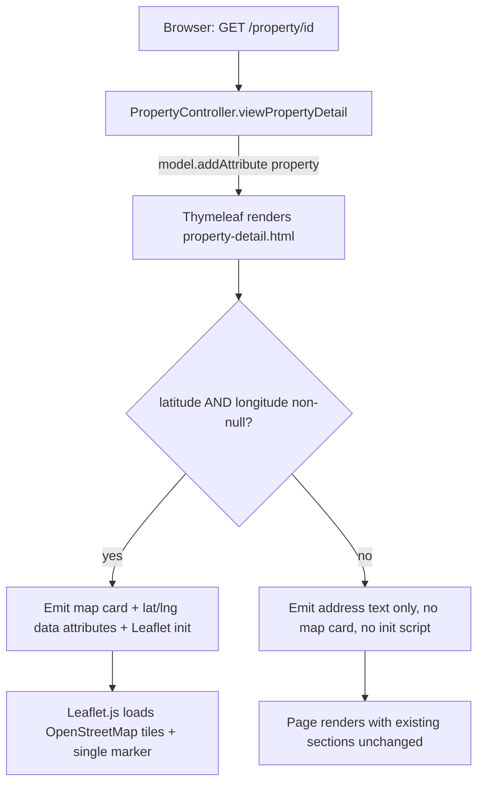
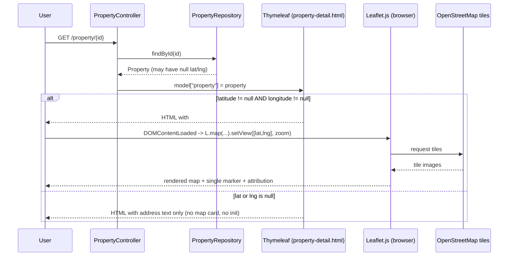

# Design Document: View Property Location (A104)

## Overview

This feature adds a small interactive map to the property detail page (`property-detail.html`),
rendered with **Leaflet.js over OpenStreetMap tiles** (no API key, no billing). The map appears
directly below the existing address text (`.detail-location`), shows a single pin at the
property's coordinates, and is styled to match the page's existing full-width card system.

The change is deliberately narrow. The `Property` entity already carries `latitude`/`longitude`
`BigDecimal` fields, the `property` table already has both columns, and
`PropertyController.viewPropertyDetail` already places the full `property` object in the model.
So no Java and no controller-route changes are required. The only edits are:

1. **`property-detail.html`** — add the Leaflet CDN assets, a Thymeleaf-guarded map card, its CSS,
   and a small init script.
2. **The seed / migration SQL** — widen the coordinate column precision from `decimal(38,2)`
   (2 fractional digits, ~1.1 km resolution) to a 6-fractional-digit decimal, and `UPDATE` the
   three seeded Summerstrand properties with real coordinates.

Verification is **manual and visual** (project constraint — no new automated test suite), so the
correctness properties below are kept lightweight and are checked by loading the page, not by tests.

## Architecture



The server decides whether the map exists **at render time**. When coordinates are missing, the
map container and its init script are never emitted, so there is no empty container and no
client-side error path to trigger (Requirement 3.2, 3.3).

## Sequence Diagram



## Components and Interfaces

### Component 1: PropertyController.viewPropertyDetail (unchanged — reused)

**Purpose**: Serves `GET /property/{id}` and exposes the property to the view.

**Interface** (existing, no change):

```java
@GetMapping("/property/{id}")
public String viewPropertyDetail(@PathVariable Integer id, Model model, Principal principal)
```

**Relevant behavior**: already calls `model.addAttribute("property", property)`, so
`${property.latitude}` and `${property.longitude}` are reachable in the template
(Requirement 7.3). **No change is made to this method or any route.**

### Component 2: Location Map card (new — in property-detail.html)

**Purpose**: A full-width card, placed immediately after the info card that contains
`.detail-location`, holding the Leaflet map div.

**Responsibilities**:
- Render only when both coordinates are non-null (`th:if`).
- Carry the coordinates into the DOM via `data-lat` / `data-lng` attributes on the map div.
- Provide a static fallback message element used if tiles/library fail to load.

### Component 3: Map_Renderer (new — inline `<script>` in property-detail.html)

**Purpose**: Client-side Leaflet initialization.

**Responsibilities**:
- Find `#propertyMap`; if absent (missing coords), do nothing.
- Parse `data-lat`/`data-lng`, initialize the map centered on the pin at zoom 15.
- Add the OSM tile layer with required attribution, add one marker.
- Show the unavailable message if initialization throws or tiles do not load within 10 seconds.

### Component 4: Leaflet.js + OpenStreetMap (new — CDN assets)

Loaded via `<link>` (CSS) and `<script>` (JS) from the Leaflet CDN in the page `<head>`/scripts.
No API key, no billing (Requirement 6.1, 6.3). Tiles come from OpenStreetMap tile servers
(Requirement 6.2) and the layer carries the OSM attribution string (Requirement 6.4).

## Data Models

### Coordinate storage on `Property` (existing fields — no entity change)

```java
// Property.java — already present, reused as-is
private java.math.BigDecimal latitude;
private java.math.BigDecimal longitude;
public java.math.BigDecimal getLatitude()  { return latitude; }
public java.math.BigDecimal getLongitude() { return longitude; }
```

### `property` table column precision (schema change)

| Column      | Current            | Target              | Reason                                              |
|-------------|--------------------|---------------------|-----------------------------------------------------|
| `latitude`  | `decimal(38,2)`    | `decimal(9,6)`      | 6 fractional digits ≈ 0.11 m; 3 integer digits hold −180..180 |
| `longitude` | `decimal(38,2)`    | `decimal(9,6)`      | Same — full valid coordinate range, no overflow     |

`decimal(9,6)` = 3 integer digits + 6 fractional digits. It safely stores latitude
(−90.000000 … 90.000000) and longitude (−180.000000 … 180.000000) without truncation
(Requirement 1.3, 1.4, 1.5).

### Seed coordinates (Summerstrand, Gqeberha)

All values sit inside the required box (lat −34.02…−33.97, lng 25.63…25.69), are expressed with
6 decimal places, are consistent with each property's recorded address, and every pair is well
over 50 m apart (Requirement 4.2, 4.3, 4.4). These are approximate street-level coordinates for
the Summerstrand addresses; exact rooftop placement should be confirmed visually during the
manual verification pass.

| propertyID | Title         | Address (from seed)                                   | latitude    | longitude  |
|------------|---------------|-------------------------------------------------------|-------------|------------|
| 1          | The Dunes     | 69 Zenios Place, Nelson Mandela Bay, Summerstrand     | −34.009800  | 25.673500  |
| 2          | The Gomery    | Gomery Avenue, Nelson Mandela University, 6031        | −34.005500  | 25.666000  |
| 3          | The admiralty | 12 Admiralty Way, Gqeberha, 6001                      | −34.013500  | 25.679500  |

Pairwise separation (approx great-circle): Dunes↔Gomery ≈ 800 m, Dunes↔admiralty ≈ 650 m,
Gomery↔admiralty ≈ 1.4 km — all ≫ 50 m (Requirement 4.4).

## Implementation Detail

### 1. CDN assets (add to `<head>`, alongside the existing stylesheet/script links)

```html
<!-- Leaflet (OpenStreetMap) — no API key required -->
<link rel="stylesheet"
      href="https://unpkg.com/leaflet@1.9.4/dist/leaflet.css"
      integrity="sha256-p4NxAoJBhIIN+hmNHrzRCf9tD/miZyoHS5obTRR9BMY="
      crossorigin="" />
<script src="https://unpkg.com/leaflet@1.9.4/dist/leaflet.js"
        integrity="sha256-20nQCchB9co0qIjJZRGuk2/Z9VM+kNiyxNV1lvTlZBo="
        crossorigin=""></script>
```

### 2. Map card — Thymeleaf-guarded (insert immediately after the `.detail-info-card` block, so it sits below the address)

The guard renders the whole card **only** when both coordinates are non-null. When either is
null, nothing (no container, no placeholder, no loader) is emitted (Requirement 2.6, 3.1–3.3).

```html
<div class="detail-map-card"
     th:if="${property.latitude != null and property.longitude != null}">
    <h2>Location</h2>
    <div id="propertyMap"
         th:attr="data-lat=${property.latitude}, data-lng=${property.longitude}"></div>
    <p id="mapUnavailable" class="map-unavailable" style="display:none;">
        Map is currently unavailable. Address: <span th:text="${property.address}">—</span>
    </p>
</div>
```

The existing `.detail-location` address text is left exactly as-is and always renders
(Requirement 2.1, 3.1, 7.2). The graceful-degradation "address unavailable" wording for a
null/empty address (Requirement 3.4) is handled where the address itself is rendered and does not
depend on the map card.

### 3. Map init script (add near the existing thumbnail script, before `</body>`)

```javascript
document.addEventListener('DOMContentLoaded', function () {
    var el = document.getElementById('propertyMap');
    if (!el) { return; } // no coordinates -> card was not rendered, nothing to do

    var lat = parseFloat(el.getAttribute('data-lat'));
    var lng = parseFloat(el.getAttribute('data-lng'));
    var fallback = document.getElementById('mapUnavailable');

    function showUnavailable() {
        if (fallback) { fallback.style.display = 'block'; }
        el.style.display = 'none';
    }

    if (typeof L === 'undefined' || isNaN(lat) || isNaN(lng)) {
        showUnavailable();
        return;
    }

    try {
        var map = L.map('propertyMap').setView([lat, lng], 15); // zoom 15 -> in [14,16]
        var loaded = false;
        var tiles = L.tileLayer('https://{s}.tile.openstreetmap.org/{z}/{x}/{y}.png', {
            maxZoom: 19,
            attribution: '&copy; <a href="https://www.openstreetmap.org/copyright">OpenStreetMap</a> contributors'
        });
        tiles.on('load', function () { loaded = true; });
        tiles.addTo(map);
        L.marker([lat, lng]).addTo(map);

        // 10s tile/render timeout -> visible "unavailable" message, container retained per R6.5
        setTimeout(function () {
            if (!loaded) {
                if (fallback) { fallback.style.display = 'block'; }
            }
            map.invalidateSize();
        }, 10000);
    } catch (e) {
        showUnavailable();
    }
});
```

Zoom is fixed at 15 (within the required 14–16, Requirement 2.3); Leaflet's default controls allow
pan and zoom within tile-supported levels (Requirement 2.5). Exactly one marker is added
(Requirement 2.2).

### 4. CSS (add inside the existing `<style>` block; mirrors `.detail-description` / `.detail-vr`)

```css
.detail-map-card {
    grid-column: 1 / -1;              /* full content width, like the other cards (R5.3) */
    background: var(--white);         /* R5.1 */
    border-radius: var(--radius);     /* 12px (R5.1) */
    box-shadow: var(--shadow-md);     /* R5.2 */
    padding: 28px;
}

.detail-map-card h2 {
    font-family: 'Playfair Display', serif;
    font-size: 18px;
    margin-bottom: 16px;
}

#propertyMap {
    height: 400px;                    /* within 380–420px (R2.4) */
    width: 100%;
    border-radius: var(--radius);     /* rounded corners */
    overflow: hidden;                 /* clip OSM tiles to the radius (R5.4) */
    z-index: 0;                       /* keep tiles/controls under page chrome */
}

.map-unavailable {
    font-size: 14px;
    color: var(--muted);
    margin-top: 12px;
}
```

`overflow: hidden` on the map div ensures square tile edges are clipped to the 12px corner radius
(Requirement 5.4).

### 5. SQL — precision migration + Summerstrand seed updates

Add to the seed script (`database/ulee_database.sql`, after the `property` rows are inserted; the
same statements can also be run once against an existing database in MySQL Workbench):

```sql
-- A104: widen coordinate precision from decimal(38,2) to 6 fractional digits (R1.3–1.5)
ALTER TABLE `property`
    MODIFY COLUMN `latitude`  decimal(9,6) DEFAULT NULL,
    MODIFY COLUMN `longitude` decimal(9,6) DEFAULT NULL;

-- A104: seed real Summerstrand coordinates for the three demo properties (R4.1–4.4).
-- Each UPDATE targets exactly one propertyID.
UPDATE `property` SET `latitude` = -34.009800, `longitude` = 25.673500 WHERE `propertyID` = 1; -- The Dunes
UPDATE `property` SET `latitude` = -34.005500, `longitude` = 25.666000 WHERE `propertyID` = 2; -- The Gomery
UPDATE `property` SET `latitude` = -34.013500, `longitude` = 25.679500 WHERE `propertyID` = 3; -- The admiralty
```

If a target `propertyID` does not exist, the matching `UPDATE` affects 0 rows and leaves all
existing coordinates unchanged; MySQL reports the matched/changed row count so a zero-match is
visible (Requirement 4.5).

## Files to Change

Per the hard scope constraint (Requirement 7.1), **only** these artifacts change:

1. `src/main/resources/templates/property-detail.html`
   - `<head>`: Leaflet CDN `<link>` + `<script>`.
   - `<style>`: `.detail-map-card`, `#propertyMap`, `.map-unavailable` rules.
   - Body: the `th:if`-guarded map card, inserted after `.detail-info-card` (below the address).
   - Scripts: the Leaflet init block.
2. `database/ulee_database.sql` (the Seed_Script)
   - `ALTER TABLE property` precision change.
   - Three `UPDATE` statements for propertyID 1, 2, 3.

**No** other page, no `Property.java`, no `PropertyController.java`, no route, and no other
resource is touched (Requirement 7.1, 7.3).

## Error Handling

| Scenario | Condition | Response | Recovery |
|----------|-----------|----------|----------|
| Missing coordinates | `latitude` or `longitude` null | Map card + init script not emitted server-side | Address text still shown; existing sections unchanged (R2.6, 3.1–3.3, 7.5) |
| Leaflet library failed to load | `typeof L === 'undefined'` | `#mapUnavailable` message shown, empty map div hidden | Address text preserved (R2.7) |
| Tiles slow / failed | No tile `load` event within 10 s | Visible "map unavailable" message; container retained | Address preserved; map may still finish loading (R6.5) |
| Init throws | Any exception in init | `catch` shows unavailable message | Address preserved |

## Correctness Properties (lightweight — verified manually)

1. **Coordinate-gated rendering**: For every property, the map card is present in the rendered
   HTML **iff** both `latitude` and `longitude` are non-null. (Check `/property/1..3` with coords,
   and any null-coord property.)
2. **Single pin, correct centre**: When shown, the map has exactly one marker at
   `(latitude, longitude)` and is centered there at zoom 15.
3. **Address invariant**: The `.detail-location` address text renders on every property page,
   with or without the map (R7.2).
4. **Scope invariant**: Diffing the change touches only `property-detail.html` and the seed SQL
   (R7.1).
5. **Range invariant**: Every seeded coordinate lies within lat [−34.02, −33.97] and
   lng [25.63, 25.69], and all three pins are pairwise > 50 m apart (R4.2, 4.4).

## Testing Strategy

Manual / visual only, per project constraint (no new automated suite):

1. Run the `ALTER` + three `UPDATE` statements.
2. Load `GET /property/1`, `/property/2`, `/property/3`. Confirm each shows a ~400 px rounded map
   card below the address, a single pin over the correct Summerstrand spot, visible OSM
   attribution, and working pan/zoom.
3. Confirm tiles are clipped to the 12 px rounded corners (no square edges poking out).
4. View (or reason about) a property with `NULL` coordinates: confirm only the address text shows,
   with no map container and no browser-console error.
5. Confirm the image gallery, info card, description, features/amenities, 360° tour, and reviews
   sections all still render exactly as before (R7.4).

## Dependencies

- **Leaflet.js 1.9.4** — via unpkg CDN (`leaflet.css`, `leaflet.js`), SRI-pinned.
- **OpenStreetMap tile servers** — `https://{s}.tile.openstreetmap.org/{z}/{x}/{y}.png`, free,
  no API key, subject to OSM tile usage policy (attribution shown).
- No new server-side dependency; no change to `pom.xml`.
